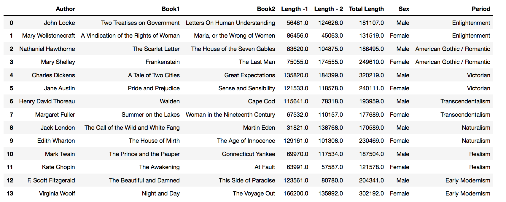

# Authorship Detection
Detect the author, author gender, and literary period of a corpus using deep learning and machine learning techniques
Data Source: http://www.gutenberg.org/
#### 14 American and British authors (7 male, 7 female), 2 books each, from 7 different literary periods

<h2>Preprocessing</h2>
<a href="https://pythonprogramming.net/named-entity-recognition-stanford-ner-tagger/">Stanford NER Tagger</a> was used to eliminate proper nouns.  
- Sample list of words eliminated for Mark Twain: 
<i>3040,(Bors, PERSON),(de, PERSON),(Ganis, PERSON),(Sir, PERSON),(Launcelot, PERSON),(Lake, LOCATION),(Sir, LOCATION),(Galahad, LOCATION),(Arthur, PERSON),(Round, ORGANIZATION)</i>
 
- % loss by each authors due to eliminating proper nouns  
{'CharlesDickens': '2.579%', 'EdithWharton': '3.844%', 'FScottFitzgerald': '3.493%', 'HenryDavidThoreau': '2.162%', 'JackLondon': '2.417%', 'JaneAustin': '3.548%', 'JohnLocke': '0.234%', 'KateChopin': '3.171%', 'MargaretFuller': '1.402%', 'MarkTwain': '1.627%', 'MaryShelley': '1.355%', 'MaryWollstonecraft': '0.538%', 'NathanielHawthorne': '1.965%', 'VirginiaWoolf': '3.345%'}
<h2>Doc2Vec</h2>
For this project, gensim's <a href="https://radimrehurek.com/gensim/models/doc2vec.html">Doc2Vec</a> was used to vectorize the corpuses. 
Following is the hyperparameters chosen for this:  
vec_size = 20 
min_count = 2 
epochs = 20 
alpha = 0.025 
 
Initially, when vectorizing corpuses with Doc2Vec, labels(author, sex, literally period) were assigned to each of the corpuses. This means, each labels were also vectorized. So cosine similarity could be used to find the most similar label vectors to each corpus:  
<b> Top 10 most similar vectors to the sample corpus by Nathaniel Hawthorne (male, gothic/romantic): </b>
{'female': 0.6568350791931152, 
 'gothic/romantic': 0.4545186161994934, 
 'male': 0.43780285120010376, 
 'NathanielHawthorne': 0.4020436406135559, 
 'JaneAustin': 0.35304591059684753, 
 'JohnLocke': 0.3185476064682007, 
 'enlightenment': 0.3154699206352234, 
 'EdithWharton': 0.28648972511291504, 
 'victorian': 0.22939543426036835, 
 'naturalism': 0.20019471645355225} 
 
 
