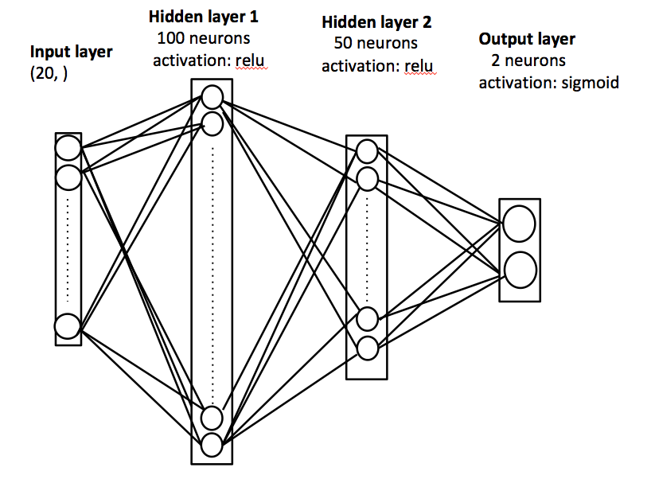
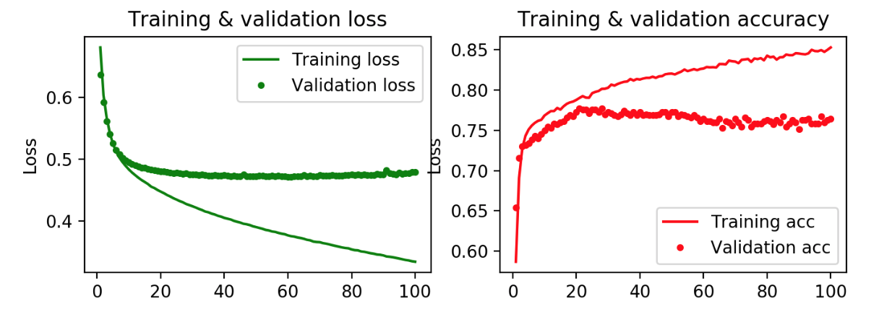
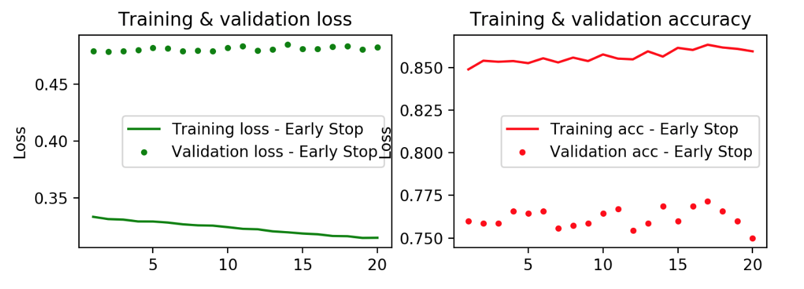
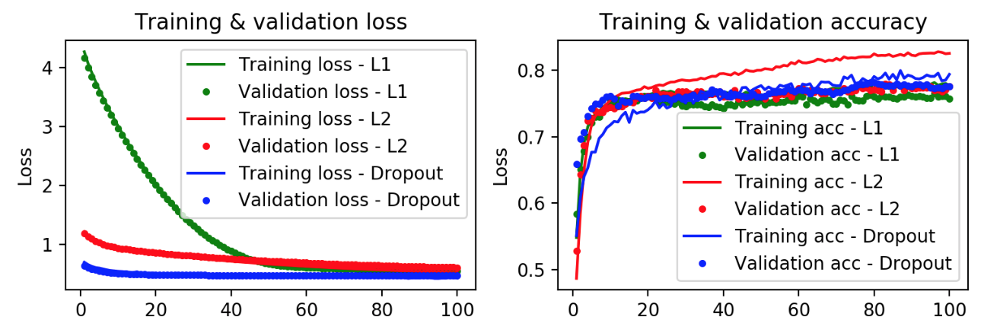
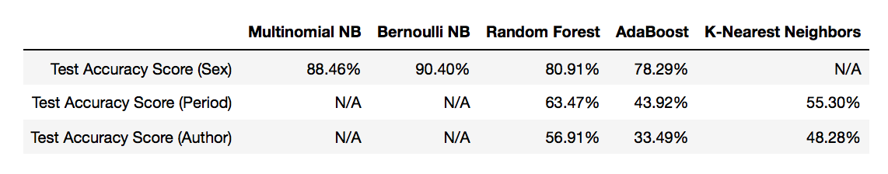

# Authorship Detection
Detect the author, author gender, and literary period of a corpus using deep learning and shallow learning techniques.
Data Source: http://www.gutenberg.org/
#### 14 American and British authors (7 male, 7 female), 2 books each, from 7 different literary periods: 

<h2>Preprocessing</h2>
<a href="https://pythonprogramming.net/named-entity-recognition-stanford-ner-tagger/">Stanford NER Tagger</a> was used to eliminate proper nouns.  
 <UL>
<LI>Sample list of words eliminated for Mark Twain: 
<i>3040,(Bors, PERSON),(de, PERSON),(Ganis, PERSON),(Sir, PERSON),(Launcelot, PERSON),(Lake, LOCATION),(Sir, LOCATION),(Galahad, LOCATION),(Arthur, PERSON),(Round, ORGANIZATION)</i>
 
<LI>Percent loss by each authors due to the elimination of proper nouns:  
{'CharlesDickens': '2.579%', 'EdithWharton': '3.844%', 'FScottFitzgerald': '3.493%', 'HenryDavidThoreau': '2.162%', 'JackLondon': '2.417%', 'JaneAustin': '3.548%', 'JohnLocke': '0.234%', 'KateChopin': '3.171%', 'MargaretFuller': '1.402%', 'MarkTwain': '1.627%', 'MaryShelley': '1.355%', 'MaryWollstonecraft': '0.538%', 'NathanielHawthorne': '1.965%', 'VirginiaWoolf': '3.345%'}
 </UL>
<h2>Doc2Vec</h2>
For this project, gensim's <a href="https://radimrehurek.com/gensim/models/doc2vec.html">Doc2Vec</a> was used to vectorize the corpuses. 
Following is the hyperparameters chosen for this model:  
<UL>
<LI>vec_size = 20 
<LI>min_count = 2 
<LI>epochs = 20 
<LI>alpha = 0.025 
 </UL>
Initially, when vectorizing corpuses with Doc2Vec, labels (author, sex, literary period) were assigned to each of the corpuses. Cosine similarity was used to find the most similar label vectors for each corpus:  
<b> Top 10 most similar vectors to the sample corpus by Nathaniel Hawthorne (male, gothic/romantic): </b> 
<UL>
<LI>Female: 0.6568350791931152 
<LI>Gothic/Romantic: 0.4545186161994934 
<LI>Male: 0.43780285120010376 
<LI>Nathaniel Hawthorne: 0.4020436406135559 
<LI>Jane Austin: 0.35304591059684753 
<LI>John Locke: 0.3185476064682007 
<LI>Enlightenment: 0.3154699206352234 
<LI>Edith Wharton: 0.28648972511291504 
<LI>Victorian: 0.22939543426036835 
<LI>Naturalism: 0.20019471645355225 
 
Then Principal Component Analysis (PCA) was applied to the corpus/label vectors to reduce the dimensionality from 20 to 3 in order to visualize the vectors. 
Explained variance ratio was <b>41.47%</b>; <b>58.53%</b> was lost by reducing the dimensionality.
 
 
The above 3D plot shows that corpus vectors are quite distinct for each author, gender and literary period. However, it was suspected that using authors, genders, and literary periods as corpus labels caused certain data leakage/bias to occur. Hence, instead of those labels, unique IDs (integers from 0 to the number of corpuses) were used as labels for the rest of the project so that each corpus would be vectorized in such a way that it was unaware of its label. 
After vectorizing the corpuses in this way, again PCA was applied to them to reduce the dimensionality from 20 to 3. This time, explained variance ratio was <b>36.81%</b> and <b>63.19%</b> was lost by reducing the dimensionality. 
 
Interestingly, corpus vectors seem to be pretty distinct for each gender. Also John Locke's writing appears to be especially unique from other authors.  
Once the corpus has been vectorized, multiple deep learning and shallow learning methods were used to detect the authors, genders, and literary periods of each corpus.
<h2>Multilayer Perceptron (MLP)</h2>
As there were not enough rows for multi-class classification, MLP was used only for gender classification (binary classification).
<h4>MLP Architecture</h4>

<h4>2 Layer Multilayer Perceptron</h4>
 
<h4>Early Stopping</h4>
 
<h4>L1, L2, Dropout</h4>
 
 <h2>Shallow Learning Models</h2>
 We also ran a series of shallow learning models for comparison, particularly given that we had a smaller dataset (we did not have 1,000 instances of author or period classes). We ran Naive Bayes, Random Forest, AdaBoost, and K-Neighbors. We tried bag of words vectorization with unigrams and bigrams and Tfidf vectorization with unigrams and bigrams.  

Our highest score for the author's gender detection was a Bernoulli Naive Bayes using bag of words with bigram, which accurately predicted the author's gender on the test with 90.4% accuracy. 

For a corpus' literary period, our best model on cross-validation was: Random guess chance - 14%.  

And for predicting on individual author, our best model on cross-validation was: Random guess chance - 7% 

<h2> Conclusion </h2>
Overall, shallow learning models performed better than deep learning model.
